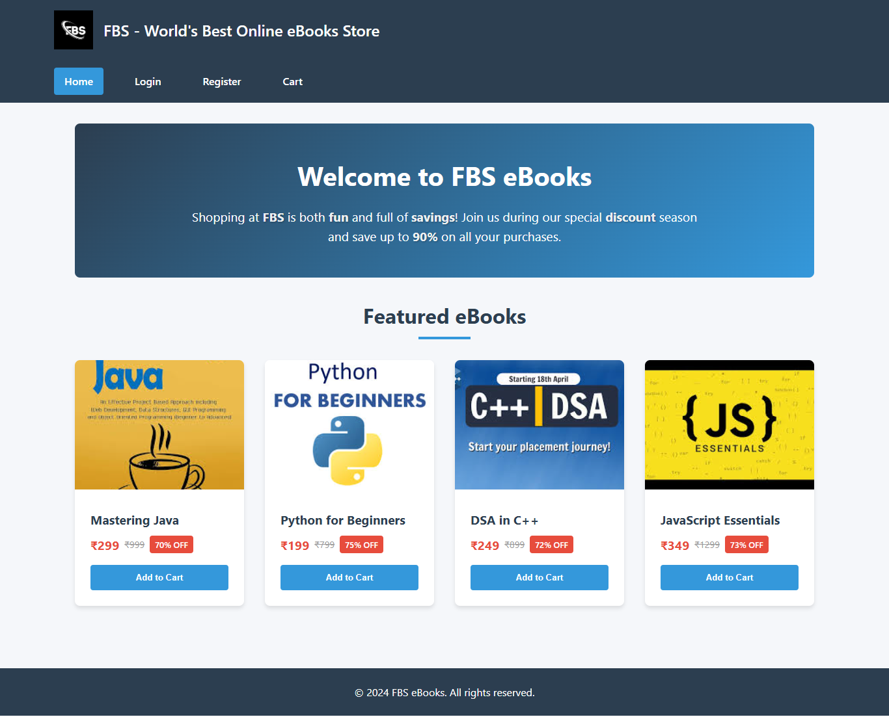
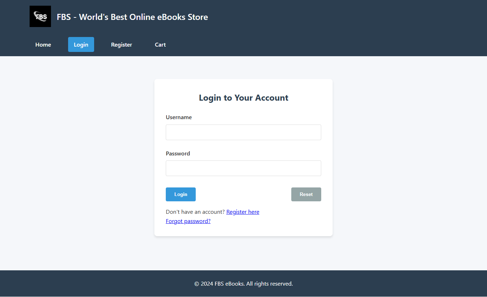

---

````markdown
# Experiment01 -🛍️ FBS EBookstore

This project is **Experiment 01** from the [SDC_23AG1A05I3](https://github.com/Srisai16/SDC_23AG1A05I3) repository, which implements a **responsive web application** for a bookstore. It includes a registration/login flow, a product catalog, and a working shopping cart, built using **CSS3 features**, **Flexbox**, and **CSS Grid**.

---

## Table of Contents

1. [Overview](#overview)  
2. [Demo](#demo)  
3. [Features](#features)  
4. [Tech Stack & CSS Approach](#tech-stack--css-approach)  
5. [Setup Instructions](#setup-instructions)  
6. [Project Structure](#project-structure)  
7. [How It Works](#how-it-works)  
8. [Screenshots](#screenshots)  
9. [Contribution](#contribution)

---

## Overview

A lightweight **client-side bookstore** web app that allows users to:

- **Register** a new account  
- **Login / Logout**  
- View a **catalog** of books  
- Add books to a **shopping cart**, view, update quantities, and checkout  

All data is stored in memory using browser local storage; no backend is required.

---

## Demo

> *Currently hosted locally.*  
Launch the project locally to explore the full feature set.

---

## Features

- 🔐 User **Registration & Login**  
- 🛒 Product **Catalog** with images, pricing, filtering  
- ✅ Add to **Cart**, update quantities, remove items  
- 📦 **Cart Summary** with total, item counts  
- 📱 Fully **responsive** design using Flexbox & Grid  

---

## Tech Stack & CSS Approach

- **HTML5**  
- **CSS3**  
  - **Flexbox**: used for navbars, forms, responsive item listings  
  - **CSS Grid**: product catalogs, cart layout  
  - **Transitions & Animations**: hover effects on buttons/cards  
- **JavaScript (ES6)**  
  - **localStorage** for persisting logged-in user & cart items  
  - Modular functions for cart and auth flows

---

## Setup Instructions

1. **Clone the repository** (if you haven't already):

   ```bash
   git clone https://github.com/Srisai16/SDC_23AG1A05I3.git
````

2. **Navigate to Experiment1 folder**:

   ```bash
   cd SDC_23AG1A05I3/Experiment1
   ```

3. **Open `index.html`** in your browser:

   * Double‑click the file, or
   * Use a simple server (optional but recommended):

     ```bash
     # Python 3 built-in server
     python3 -m http.server 8000
     ```

4. Browse to `http://localhost:8000/` and enjoy!

---

## Project Structure

Experiment01/
│
├── assets/
│   └── images/
│       ├── cart.png          # Screenshot of shopping cart UI
│       ├── catalog.png       # Screenshot of catalog/product listing
│       └── login.png         # Screenshot of login/register UI
│
├── index.html                # Homepage (book catalog with navigation)
├── login.html                # Login form
├── registration.html         # New user registration form
├── cart.html                 # Cart page with cart summary and items
├── style.css                 # Main stylesheet (Flexbox, Grid, animations)
└── README.md                 # Project documentation (this file)

---

## How It Works

1. **Registration → Login**

   * Users submit a form and credentials are saved in `localStorage`.
   * On login, session state is stored and user is redirected to `index.html`.

2. **Cart Page**

   * `cart.html` diplays cart data, item list using Flex/Grid.
   * Displays subtotal and total dynamically.

3. **Responsiveness & Design**

   * Nav header uses **Flexbox** for horizontal layout and mobile toggle.
   * Product grid uses **CSS Grid** to adjust columns based on screen width.
   * Cart rows use Flexbox for alignment and spacing.

---

## Screenshots

| Page                 | View                                       |
| -------------------- | ------------------------------------------ |
| **Catalog Page**     |  |
| **Login / Register** |      |
| **Shopping Cart**    |        |

---

## Contribution

This experiment is part of academic coursework. Feel free to:

* Add more UI polish
* Integrate a backend (e.g., Node.js + Express + MongoDB)
* Enhance accessibility & form validation

---

## Contact

Maintainer: **Srisai16**
Repo: [https://github.com/Srisai16/SDC\_23AG1A05I3](https://github.com/Srisai16/SDC_23AG1A05I3)

```

---

