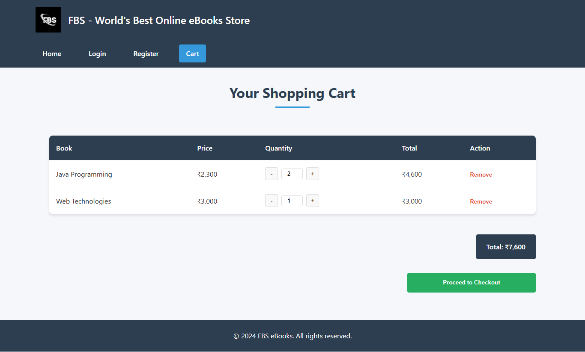
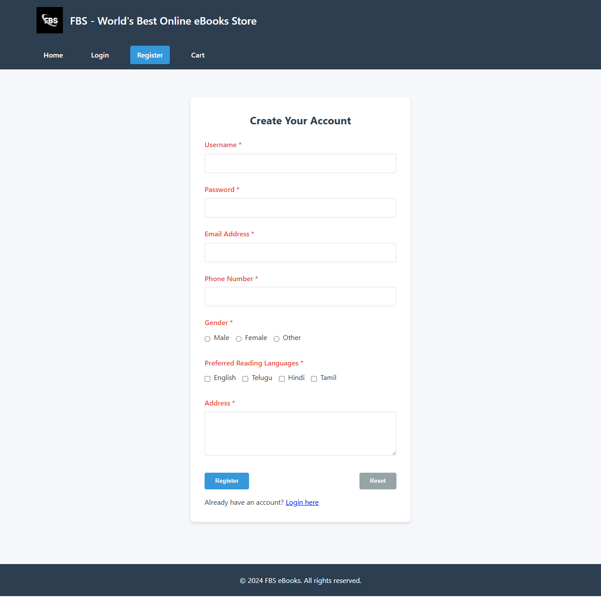

---

````markdown
# Experiment02 - 📚 FBS Ebookstore
---

## Table of Contents

1. [Overview](#overview)  
2. [Live Demo](#live-demo)  
3. [Features](#features)  
4. [Tech & CSS Approach](#tech--css-approach)  
5. [Installation & Usage](#installation--usage)  
6. [Project Structure](#project-structure)  
7. [Functional Flow](#functional-flow)  
8. [Screenshots](#screenshots)  
9. [Contribution](#contribution)

---

## Overview

A **single-page-like** ebook store enabling users to:

- **Register** for access  
- **Log in/out**  
- Browse a **catalog** of ebooks  
- Add ebooks to a **cart**, adjust quantities  
- **Checkout** using a neat cart summary

Data is managed via browser **localStorage**, and there’s no backend dependency.

---

## Live Demo

**Run locally** (no hosting provided):

```bash
# Clone the repo
git clone https://github.com/Srisai16/SDC_23AG1A05I3.git

# Go to Experiment02
cd SDC_23AG1A05I3/Experiment02

# Serve with Python (optional but recommended)
python3 -m http.server 8000
````

Open [http://localhost:8000](http://localhost:8000) in your browser.

---

## Features

* 🔐 **User Authentication**: Registration & login forms
* 📖 **Ebook Catalog**: Cards with title, author, price, and "Add to Cart"
* 🛒 **Shopping Cart**: Increment/decrement qty, remove, and view summary
* 💳 **Cart Summary**: Displays subtotal, total count, grand total
* 📱 **Responsive Design**:

  * **Flex/Grid**: handles layout and spacing
  * **Bootstrap**: applies responsive breakpoints, grid system, navbar, and components

---

## Tech & CSS Approach

* **HTML5** + **Bootstrap 5**: for layout, responsive navbars, containers, modals
* **CSS3**:

  * **Flexbox** for card alignment and cart row layout
  * **CSS Grid** for catalog layout on wider screens
  * Hover transitions and card animations
* **JavaScript (ES6)**:

  * `localStorage` usage for auth state and cart persistence
  * Modular JS (`auth.js`, `catalog.js`, `cart.js`)

---

## Installation & Usage

1. **Clone the repository**:

   ```bash
   git clone https://github.com/Srisai16/SDC_23AG1A05I3.git
   ```

2. **Switch to Experiment 02 folder**:

   ```bash
   cd SDC_23AG1A05I3/Experiment02
   ```

3. **Launch the app**:

   * Open `index.html` directly, or
   * Start a server:

     ```bash
     python3 -m http.server 8000
     ```

4. **Browse** to `http://localhost:8000` to start using the ebookstore.

---

## Project Structure

Experiment02/
│
├── add_to_cart.php                 # Handles cart addition via PHP
│
├── ajax/                          # AJAX handlers for cart, coupons
│   ├── add_to_cart.php            # AJAX handler for adding items to cart
│   └── apply_coupon.php           # AJAX handler for applying discount coupons
│
├── cart.html                      # Static cart layout (alternative to cart.php)
├── cart.php                       # Dynamic cart page with PHP
│
├── Home-FBS-eBooks-Store.png      # Screenshot/image asset for homepage
│
├── images/                        # Image assets for products and UI
│   ├── c++DSA.jpg
│   ├── ebooks.jpg
│   ├── fbslogo.jpg
│   ├── JSessentials.jpg
│   ├── masteringjava.jpg
│   └── pybeg.jpg
│
├── includes/                      # Reusable PHP components
│   ├── config.php                 # Configuration constants
│   ├── db.php                     # Database connection setup
│   ├── footer.php                 # Footer section
│   └── header.php                 # Header/navbar section
│
├── index.html                     # Static homepage (non-PHP)
├── index.php                      # Main landing page (dynamic)
│
├── login.html                     # Static login page
├── login.php                      # Login logic handling
├── logout.php                     # Logout and session clearing
│
├── product-detail.php             # Product detail view
├── products.php                   # Product catalog (server-rendered)
│
├── register.php                   # Registration logic
├── registration.html              # Static registration form
│
├── style.css                      # Custom styling (Flexbox, Grid, Bootstrap)
├── test.php                       # Test/development file
└── README.md                      # Project documentation


---

## Functional Flow

1. **User Registration/Login**

   * Auth forms via modal overlay
   * User credentials and session stored in `localStorage`

2. **Catalog Display**

   * `catalog.js` dynamically populates cards using Flex/Grid
   * "Add to Cart" adds the item with selected quantity to `localStorage`

3. **Cart Page**

   * `cart.js` fetches cart data and displays using Bootstrap tables + Flex
   * Users can update quantity, remove items, and view totals dynamically

4. **Bootstrap Integration**

   * Responsive navbar with login/register links
   * Grid system ensures catalog adapts from 1–4 columns
   * Cards and buttons leverage Bootstrap styles

---

## Screenshots

| Catalog View                          | Cart Summary                    |
| ------------------------------------- | ------------------------------- |
|  |  |

| Login/Register Modal                        |
| ------------------------------------------- |
|  |

---

## Contribution

This is an academic demo of a responsive, client‑side web app. You can extend it by:

* Adding a real backend (e.g., Node.js + Express + MongoDB)
* Integrating user password hashing & validation
* Improving accessibility & UI polish

---

## Credits

Maintained by **Srisai16**
GitHub repo: [https://github.com/Srisai16/SDC\_23AG1A05I3](https://github.com/Srisai16/SDC_23AG1A05I3)

Feel free to open issues or raise pull requests for improvements!

```

---

