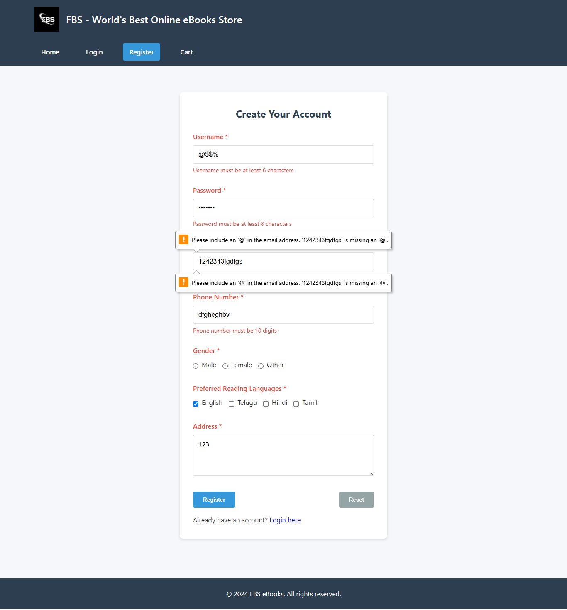

# Experiment03 - 🛡️ FBS Ebookstore (Client‑Side Validation)

This project is **Experiment 03** from the [SDC_23AG1A05I3](https://github.com/Srisai16/SDC_23AG1A05I3) repo. It builds on the previous experiments by augmenting the FBS Ebookstore with **JavaScript client-side validation** on Registration, Login, Catalog, and Cart pages.

---

## 🎯 Objectives

- Add **form validation** to prevent incorrect user inputs
- Validate **registration** (email format, password strength, required fields)
- Validate **login** (empty fields)
- Optional validation on catalog search/filter (e.g., minimum length)
- Validate **cart** (quantities must be positive integers)

---

## ✅ Validation Features

1. **Registration Page** (`register.html` / modal):
   - Email must follow proper format
   - Password length ≥ 6 characters
   - Confirm password must match password
   - Name and required fields must not be blank
   - Errors appear inline (under the input field)

2. **Login Page** (`login.html` / modal):
   - Ensure username/email and password fields aren't empty
   - Display error if fields are blank

3. **Catalog/Search** (`index.html`):
   - If there's a search/filter input, ensure it's not blank or too short
   - Provide user feedback (e.g., “Search term must be at least 3 characters”)

4. **Cart Page** (`cart.html`):
   - Quantity inputs accept only integers ≥ 1
   - Prevent form submission if invalid quantity is detected
   - Provide inline error messages near the particular quantity field

---

## 🛠 Tech & Implementation

- All validation logic is written in **plain JavaScript** (no library)
- Uses **`addEventListener('submit', …)`** to hook onto forms
- Stops form submission with `event.preventDefault()` if invalid
- Inline messages are injected into a `<span class="error">…</span>` container
- Input event handlers correct formatting in real time
- Visual feedback uses CSS classes (e.g., `.error`, `.is-invalid`)

---

## 📂 Project Structure (Experiment03)

```bash
    Experiment03/
    │
    ├── add_to_cart.php                  # Handles cart addition logic (PHP)
    │
    ├── ajax/                            # AJAX operations for cart & coupons
    │   ├── add_to_cart.php
    │   └── apply_coupon.php
    │
    ├── Cart-FBS-eBooks-Store.png        # Screenshot image of cart page
    │
    ├── cart.html                        # Static cart layout
    ├── cart.php                         # Dynamic cart page
    │
    ├── images/                          # Image assets used across pages
    │   ├── c++DSA.jpg
    │   ├── ebooks.jpg
    │   ├── fbslogo.jpg
    │   ├── JSessentials.jpg
    │   ├── masteringjava.jpg
    │   ├── pybeg.jpg
    │
    ├── includes/                        # Reusable PHP includes
    │   ├── config.php                   # Configuration values
    │   ├── db.php                       # Database connection setup
    │   ├── footer.php                   # Footer template
    │   └── header.php                   # Header template
    │
    ├── index.html                       # Home page with catalog/search
    ├── index.php                        # PHP version of homepage
    │
    ├── js/                              # JavaScript logic (including validation)
    │   ├── cart.js                      # Cart page interactions
    │   ├── main.js                      # Common JS functionality
    │   ├── validateAuth.js              # JS validation for login/register
    │   ├── validateCatalog.js           # JS validation for search/filter
    │   └── validateCart.js              # JS validation for cart quantities
    │
    ├── login.html                       # Login page
    ├── login.php                        # Login logic
    ├── logout.php                       # Logout script
    │
    ├── product-detail.php               # Detailed product view page
    ├── products.php                     # Displays product listings
    │
    ├── README.md                        # Project documentation
    │
    ├── register.php                     # Registration logic
    ├── registration.html                # Registration form page
    │
    ├── style.css                        # Custom CSS styling & validation visuals
    ├── test.php                         # Testing/development script

```

---

## 💡 How to Use / Test

1. **Clone or pull** the latest `Experiment3` folder.  
2. Open the relevant HTML pages (i.e., `register.html`, `login.html`, `cart.html`, `index.html`) in your browser.  
3. Try submitting forms with invalid inputs (e.g., empty fields, bad email, mismatched passwords, qty 0 or non-numeric).  
4. You should see inline error messages and form submissions blocked.

---

## 💻 Code Snippets

### Registration Validation

```bash js
    // In validateAuth.js
    form.addEventListener('submit', function(e) {
    clearErrors();
    if (!email.match(emailRegex)) {
        showError(emailField, 'Invalid email format');
        valid = false;
    }
    if (password.length < 6) {
        showError(passwordField, 'Password must be ≥ 6 chars');
        valid = false;
    }
    if (password !== confirmPassword) {
        showError(confirmPasswordField, 'Passwords must match');
        valid = false;
    }
    if (!valid) e.preventDefault();
    });
```

### Cart Page Quantity Validation

```bash js
    cartForm.addEventListener('submit', function(e) {
    let isValid = true;
    qtyInputs.forEach(input => {
        const val = parseInt(input.value, 10);
        if (!Number.isInteger(val) || val < 1) {
        showError(input, 'Enter a whole number ≥ 1');
        isValid = false;
        }
    });
    if (!isValid) e.preventDefault();
    });
```

---

## 🎯 Testing Guidelines

- Try **blank**, improperly formatted, or mismatched inputs; the validation should catch them
- Ensure that fixing the input **removes** the error message in real time
- In the cart, try setting a quantity to zero, negative, decimal, or alphabetic characters
- Test across different screen sizes (validation layout should remain responsive)

---

## 📝 Next Steps

- Add **regular expressions** for name fields (e.g., no numbers or special chars)
- Introduce **real-time validation feedback** (e.g., green border on valid inputs)
- Expand validation to **catalog filters** (e.g., price range, date filters)
- Localize error messages for multiple languages (using simple i18n)

---

---

## Screenshots

| Register Validation                        |
| ------------------------------------------- |
|  |

---

---

## ✉️ Contact

Maintained by **Srisai16**
GitHub: [https://github.com/Srisai16/SDC\_23AG1A05I3](https://github.com/Srisai16/SDC_23AG1A05I3)
Feel free to report issues or submit pull requests!
