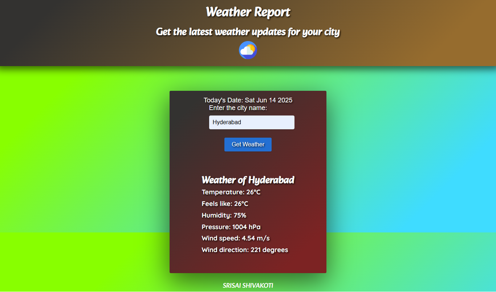

# Experiment04 - 🌦️ Weather App


A modern weather application built with React and TypeScript that provides real-time weather forecasts for any location worldwide.

---

## Table of Contents

- [Experiment04 - 🌦️ Weather App](#experiment04---️-weather-app)
  - [Table of Contents](#table-of-contents)
  - [✨ Features](#-features)
  - [🎥 Github](#-github)
  - [📸 Screenshots](#-screenshots)
  - [🛠️ Technologies](#️-technologies)
  - [🚀 Installation](#-installation)
  - [⚙️ Configuration](#️-configuration)
    - [Environment Variables](#environment-variables)
    - [Getting an API Key](#getting-an-api-key)
  - [🌐 API Usage](#-api-usage)
  - [💻 Development](#-development)
    - [Project Structure](#project-structure)
    - [Available Scripts](#available-scripts)
  - [🧪 Testing](#-testing)
  - [🚀 Deployment](#-deployment)
    - [Vercel (Recommended)](#vercel-recommended)
    - [Other Options](#other-options)
  - [🤝 Contributing](#-contributing)

## ✨ Features

- 🔍 Search weather by city name
- 📍 Get current location weather automatically
- 📊 Detailed weather information including:
- Current temperature
- Humidity
- Wind speed
- Atmospheric pressure
- Sunrise/sunset times
- 🌞 5-day weather forecast
- 🌙 Dark/light mode toggle
- 📱 Fully responsive design
- ⚡ Fast loading with caching

## 🎥 Github

[Github](https://github.com/Srisai16/SDC_23AG1A05I3.git)

## 📸 Screenshots

| Weather App |
|------------|
|  |

## 🛠️ Technologies

- **Frontend**: React 18 with TypeScript
- **State Management**: React Context API
- **Styling**: Tailwind CSS
- **Icons**: React Icons
- **Maps**: React Leaflet (for location visualization)
- **API**: OpenWeatherMap API
- **Build**: Vite

## 🚀 Installation

1. Clone the repository:

   ```bash
   git clone https://github.com/Srisai16/SDC_23AG1A05I3.git
   ```

2. Install dependencies:

   ```bash
   npm install
   # or
   yarn install
   ```

3. Create a `.env` file in the root directory:

   ```env
   VITE_OPENWEATHER_API_KEY=your_api_key_here
   ```

4. Start the development server:

   ```bash
   npm run dev
   ```

5. Open your browser at:

   `http://localhost:3000`

## ⚙️ Configuration

### Environment Variables

| Variable | Description |
|----------|-------------|
| `VITE_OPENWEATHER_API_KEY` | Your OpenWeatherMap API key |

### Getting an API Key

1. Sign up at [OpenWeatherMap](https://openweathermap.org/api)
2. Get your free API key (start with the Free plan)
3. Add it to your `.env` file

## 🌐 API Usage

The app uses the following OpenWeatherMap API endpoints:

- Current Weather: `https://api.openweathermap.org/data/2.5/weather`
- 5-Day Forecast: `https://api.openweathermap.org/data/2.5/forecast`
- Geocoding: `https://api.openweathermap.org/geo/1.0/direct`

## 💻 Development

### Project Structure

```bash
  Experiment04/
  │
  ├── .env                         # Environment variables (API keys etc.)
  ├── DeleteData.java              # Java file for deleting weather data (optional integration)
  ├── DisplayData.java             # Java file for displaying weather data (optional integration)
  ├── index.html                   # Static HTML file (may be legacy or entry point)
  ├── package.json                 # Project metadata and dependencies
  ├── package-lock.json            # Dependency tree lock file
  ├── README.md                    # This project’s documentation
  ├── server.js                    # Express/Node backend (if used for API proxying)
  ├── Weather-App.png              # Screenshot image used in README
  │
  ├── Weather-app-main/            # Static Weather App frontend (JS/HTML/CSS version)
  │   ├── index.html               # Main HTML for classic JS version
  │   ├── script.js                # Core weather logic in JavaScript
  │   ├── style.css                # CSS styles for the static app
  │   ├── cloudy.png               # Weather icon asset
  │   ├── ReadMeAboutindexhtml.md       # Notes/documentation about index.html
  │   ├── ReadMeAboutOldNewScriptjs     # Notes on script.js versions
  │   └── ReadMeAboutStyleCss.md        # Notes on CSS design choices

```

---

### Available Scripts

- `npm run dev`: Start development server
- `npm run build`: Create production build
- `npm run lint`: Run ESLint
- `npm run preview`: Preview production build
- `npm run test`: Run tests

## 🧪 Testing

The app includes:

- Unit tests with Vitest
- Component tests with React Testing Library
- End-to-end tests with Cypress (optional)

To run tests:

```bash
    npm test
```

## 🚀 Deployment

### Vercel (Recommended)

1. Install Vercel CLI:

   ```bash
   npm install -g vercel
   ```

2. Deploy:

   ```bash
   vercel
   ```

### Other Options

- Netlify
- GitHub Pages
- Firebase Hosting

## 🤝 Contributing

1. Fork the project
2. Create your feature branch (`git checkout -b feature/AmazingFeature`)
3. Commit your changes (`git commit -m 'Add some AmazingFeature'`)
4. Push to the branch (`git push origin feature/AmazingFeature`)
5. Open a Pull Request

---

**Stay ahead of the weather!** ☔⛅🌤️

---
