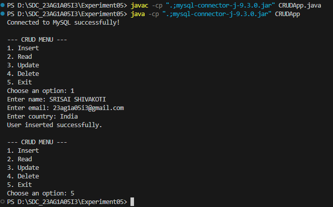
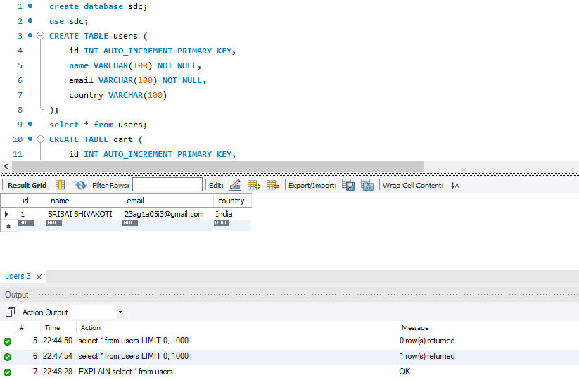

# **Experiment05 - Database CRUD Operations with Java and MySQL**

## **📌 Overview**

This experiment demonstrates how to create a **Java standalone application** that connects to a **MySQL database** and performs **CRUD (Create, Read, Update, Delete)** operations on a `users` table.

### **🔹 Key Features**

✅ **Database Connectivity** – Uses JDBC to connect to MySQL
✅ **CRUD Operations** – Insert, Read, Update, and Delete records
✅ **User-Friendly CLI** – Simple menu-driven interface
✅ **Prepared Statements** – Prevents SQL injection

---

## 💻 Development

### Project Structure

```bash
    Experiment05/
    │
    ├── CRUDApp.java                  # Main Java source file for the CRUD application
    ├── CRUDApp.class                 # Compiled class file (optional if bin/ is used)
    ├── bin/                          # Compiled output directory
    │   └── CRUDApp.class             # Java class file generated from compilation
    │
    ├── mysql-connector-j-9.3.0.jar   # MySQL JDBC connector (required for DB connection)
    ├── CRUDAPP.png                   # Screenshot of the running Java CRUD application
    ├── mysql_database.png            # Screenshot of the MySQL database structure or records
    └── README.md                     # Project documentation

```

## **🛠️ Technologies Used**

- **Backend:** Java (JDBC)
- **Database:** MySQL
- **Driver:** `mysql-connector-j-9.3.0.jar`

---

## **📋 Steps to Run the Project**

### **1️⃣ Prerequisites**

- **Java JDK 8+** installed
- **MySQL Server** running
- **MySQL Connector/J** driver

### **2️⃣ Database Setup**

1. **Create a database:**

   ```sql
   CREATE DATABASE sdc;
   USE sdc;
   ```

2. **Create a `users` table:**

   ```sql
   CREATE TABLE users (
       id INT AUTO_INCREMENT PRIMARY KEY,
       name VARCHAR(100),
       email VARCHAR(100),
       country VARCHAR(100)
   );
   ```

### **3️⃣ Compile & Run**

1. **Compile the Java file:**

   ```bash
   javac -cp ".;mysql-connector-j-9.3.0.jar" CRUDApp.java
   ```

2. **Run the application:**

   ```bash
   java -cp ".;mysql-connector-j-9.3.0.jar" CRUDApp
   ```

---

### **🔹 Database Connection**

```java
static final String JDBC_URL = "jdbc:mysql://localhost:3306/sdc?useSSL=false&serverTimezone=UTC";
static final String DB_USER = "user";
static final String DB_PASS = "password";

try (Connection conn = DriverManager.getConnection(JDBC_URL, DB_USER, DB_PASS)) {
    System.out.println("Connected to MySQL successfully!");
    // ... CRUD operations
} catch (SQLException e) {
    System.out.println("Connection failed: " + e.getMessage());
}
```

### **🔹 CRUD Operations**

| **Operation** | **Method** | **SQL Query** |

|--------------|------------|--------------|
| **Create** | `insertUser()` | `INSERT INTO users (name, email, country) VALUES (?, ?, ?)` |
| **Read** | `readUsers()` | `SELECT * FROM users` |
| **Update** | `updateUser()` | `UPDATE users SET name=?, email=?, country=? WHERE id=?` |
| **Delete** | `deleteUser()` | `DELETE FROM users WHERE id=?` |

---

## **🖼️ Screenshots**

### **1️⃣ Program Execution**

|  |

### **2️⃣ Database Records After Insertion**

|  |

---

## **🔍 What We Achieved?**

✔ **Established a connection** between Java and MySQL using JDBC
✔ **Implemented all CRUD operations** with `PreparedStatement` for security
✔ **Built a simple CLI menu** for user interaction
✔ **Verified data persistence** in the database

---

## **🚀 Future Improvements**

- [ ] Add input validation
- [ ] Implement a GUI (JavaFX/Swing)
- [ ] Support multiple database types (Oracle, PostgreSQL)

---

**🔗 Repository:** [GitHub Link](https://github.com/Srisai16/SDC_23AG1A05I3.git)
