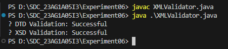

---

```markdown
# Experiment06 - 📚 XML Validation with DTD and XSD Using Java

## 🎯 AIM

To validate a Book Store XML file using both **DTD** and **XSD** schema definitions via a custom Java program.

---

## 🧾 DESCRIPTION

This experiment demonstrates the use of **Java-based XML validation** for a bookstore dataset. The application uses the Java **DOM Parser** and **Schema Validator** to:

- Parse an XML file validated with a DTD (`bookstore_dtd.xml`)
- Validate the same XML file using an XSD (`bookstore.xsd`)
  
It showcases how Java can perform schema validations programmatically and outputs the validation status on the console.

The program uses `DocumentBuilderFactory` for DTD validation and `SchemaFactory` for XSD validation.

---

## 🗂️ PROJECT STRUCTURE

```

Experiment06/
├── bookstore.dtd           # DTD schema for structural validation
├── bookstore.xsd           # XSD schema for advanced data-type validation
├── bookstore_dtd.xml       # XML to validate with DTD
├── bookstor_xsd.xml        # XML to validate with XSD
├── XMLValidator.java       # Java source file for validator
└── XMLValidator.class      # Compiled class file

````

---

## ⚙️ INSTALLATION & SETUP

### ✅ PREREQUISITES

- Java JDK (8 or higher)
- VS Code / IntelliJ / Eclipse
- Terminal or Command Prompt

---

## 🧪 STEPS TO RUN THE PROJECT

1. **Open a Terminal and Navigate to Project Folder:**
   ```bash
   cd path/to/Experiment06
````

2. **Compile the Java Program:**

   ```bash
   javac XMLValidator.java
   ```

3. **Run the Validator:**

   ```bash
   java XMLValidator
   ```

4. **Expected Output (if both validations succeed):**

   ```
   ✅ DTD Validation: Successful
   ✅ XSD Validation: Successful
   ```

---

## 🧾 OUTPUT SCREENSHOT

> Replace the placeholder below with your actual console output screenshot.



---

## ✅ FILE DESCRIPTIONS

| File Name           | Description                                |
| ------------------- | ------------------------------------------ |
| `bookstore.dtd`     | Declares the basic structure for bookstore |
| `bookstore.xsd`     | XSD schema defining data types and rules   |
| `bookstore_dtd.xml` | XML sample that references `bookstore.dtd` |
| `bookstore_xsd.xml` | XML sample that references `bookstore.xsd` |
| `XMLValidator.java` | Java program that runs both validations    |

---

## 💡 NOTES

* For **DTD validation**, `bookstore_dtd.xml` must include:

  ```xml
  <!DOCTYPE bookstore SYSTEM "bookstore.dtd">
  ```

* For **XSD validation**, `bookstore_xsd.xml` must include:

  ```xml
  xmlns:xsi="http://www.w3.org/2001/XMLSchema-instance"
  xsi:noNamespaceSchemaLocation="bookstore.xsd"
  ```

* Ensure all files are in the same directory for local file access.

---

## 👨‍💻 AUTHOR

Developed as part of XML & Web Technologies Lab coursework.

**🔗 Repository:** [GitHub Link](#) (https://github.com/Srisai16/SDC_23AG1A05I3.git)

---
