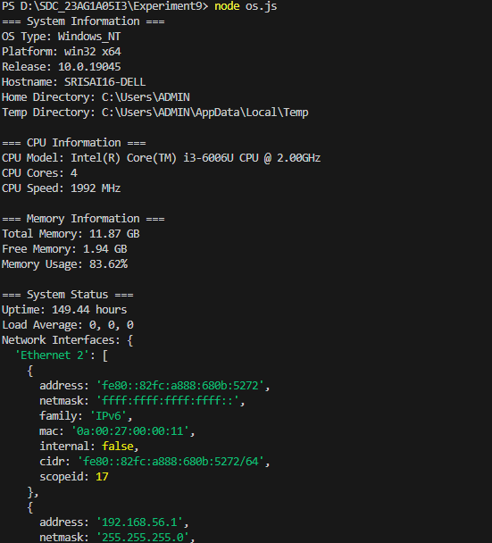

# Experiment09 -📦 Node.js Core Modules Exploration


A comprehensive demonstration of **Node.js core modules** including `HTTP`, `OS`, `Path`, `Events`, and `FS`.

---

## ✨ Features

- 🔧 Custom HTTP server with request logging
- 🖥️ System diagnostics using OS module
- 📁 Path operations using the Path module
- ⚡ Event-driven programming with EventEmitter
- 💾 Memory and CPU monitoring
- 🧭 Cross-platform file path handling

---

## 🧩 Core Modules Demonstrated

1. **HTTP** – Creating a server and handling HTTP requests
2. **OS** – Accessing system-level information (CPU, memory, uptime)
3. **Path** – File and directory path manipulations
4. **Events** – EventEmitter to manage custom events
5. **FS** – File operations included in `path.js`

---

## 🛠️ Installation

### ✅ Prerequisites

- Node.js (v14+ recommended)

### 🔍 Steps

1. Clone the repository:

```bash
git clone https://github.com/Srisai16/SDC_23AG1A05I3.git
cd SDC_23AG1A05I3/Experiment09
```

1. No additional dependencies are required — all modules are core to Node.js.

---

## Project Structure

```bash

    Experiment09/
    ├── events.js               # Demonstrates Node.js 'events' module usage
    ├── os.js                   # Script using Node.js 'os' module
    ├── path.js                 # Script using Node.js 'path' module
    ├── server.js               # Basic HTTP server setup
    ├── localhost-3000.png      # Screenshot of running server on localhost
    ├── os.png                  # Output screenshot of os module execution
    ├── package.json            # Project configuration and dependencies
    ├── package-lock.json       # Dependency lock file
    └── README.md               # Project documentation

```

## 🚀 Running the Examples

### 1. HTTP Server

```bash
node server.js
```

📍 Access in browser: `http://localhost:3000`

🖼️ Sample Output:

```bash
    Server running at http://localhost:3000/
    Press Ctrl+C to stop the server
    [2023-06-20T10:30:45.123Z] GET /
    [2023-06-20T10:31:10.456Z] GET /favicon.ico
```

---

### 2. Events Module

```bash
node events.js
```

### 3. OS Module

```bash
node os.js
```

🖼️ Sample Output:

|  |

```bash
=== System Information ===
OS Type: Linux
Platform: linux x64
Release: 5.15.0-76-generic
Hostname: my-server
Home Directory: /home/user
Temp Directory: /tmp

=== CPU Information ===
Model: Intel(R) Core(TM) i7-10700K @ 3.80GHz
Cores: 8
Speed: 3800 MHz

=== Memory Information ===
Total: 8 GB
Free: 2 GB
Usage: 75.34%

=== System Status ===
Uptime: 12.34 hours
Load Average: 0.52, 0.48, 0.45
```

---

### 4. Path Module

```bash
node path.js
```

---

## 📚 Learning Resources

- [Node.js Official Documentation](https://nodejs.org/en/docs/)
- [Path Module Guide](https://nodejs.org/api/path.html)
- [Understanding the Event Loop](https://nodejs.dev/learn/the-nodejs-event-loop)

---

## 🧾 Summary

This project demonstrates:

- ✅ Fully functional HTTP server
- ✅ Real-time system diagnostics
- ✅ File system and path handling
- ✅ Event-driven development in Node.js
- ✅ Best practices: error handling, formatting, and modularity

---
