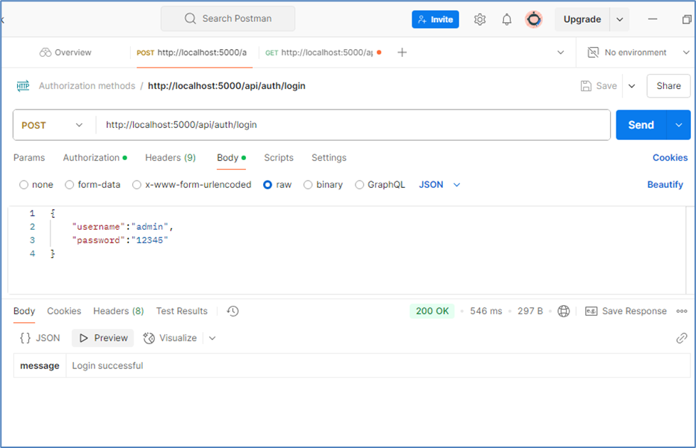
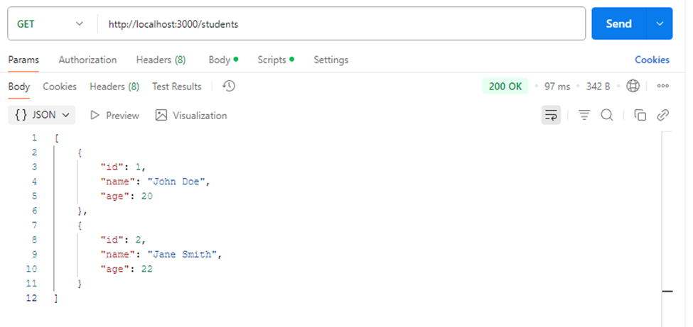

# Experiment10 - 📘 Student CRUD REST API with Express & JWT


A simple RESTful API built with **Express.js** that demonstrates full **CRUD operations** on student data with **JWT-based authentication** and middleware.

---

## 📑 Table of Contents

- [Experiment10 - 📘 Student CRUD REST API with Express \& JWT](#experiment10----student-crud-rest-api-with-express--jwt)
  - [📑 Table of Contents](#-table-of-contents)
  - [🎯 Features](#-features)
  - [🧰 Technologies Used](#-technologies-used)
  - [📁 Project Structure](#-project-structure)
  - [⚙️ Installation \& Setup](#️-installation--setup)
    - [✅ Prerequisites](#-prerequisites)
    - [🔧 Steps to Run](#-steps-to-run)
    - [Clone the repository](#clone-the-repository)
    - [Install dependencies](#install-dependencies)
    - [Set environment variables](#set-environment-variables)
    - [Start the server](#start-the-server)
  - [🔐 Authentication](#-authentication)
    - [`POST /login`](#post-login)
  - [🧪 API Usage](#-api-usage)
    - [🔍 Get All Students](#-get-all-students)
    - [➕ Create a New Student](#-create-a-new-student)
    - [📝 Update Student](#-update-student)
    - [❌ Delete Student](#-delete-student)
  - [🧪 Sample Output](#-sample-output)
  - [📷 Screenshot](#-screenshot)

---

## 🎯 Features

- 🔐 JWT-based authentication system
- 📝 Full CRUD operations on student records
- 🛡️ Secured routes using custom middleware
- ✅ Organized MVC-style folder structure
- 📦 Simple and minimal setup using only core tools

---

## 🧰 Technologies Used

- **Backend**: Node.js, Express.js
- **Authentication**: JSON Web Tokens (JWT)
- **Environment Management**: dotenv

---

## 📁 Project Structure

```bash
   Experiment10/
   ├── app.js                          # Main entry point for the server (Express app)
   ├── index.js                        # Optional alternative entry file or setup
   ├── JWT_SECRET.env                  # Environment file storing JWT secret key
   ├── package.json                    # Project config and dependencies
   ├── package-lock.json               # Dependency lock file
   ├── studentmanageAPI.png            # Screenshot of API usage
   ├── studentmanagement.png           # Screenshot of UI or API results
   ├── README.md                       # Project documentation

   ├── controllers/
   │   └── userController.js           # Controller handling user-related logic

   ├── middleware/
   │   └── authMiddleware.js           # Middleware to authenticate JWT tokens

   ├── routes/
   │   └── students.js                 # Route definitions for student API endpoints

```

---

## ⚙️ Installation & Setup

### ✅ Prerequisites

- Node.js v14 or later
- Postman or any API testing tool

### 🔧 Steps to Run

### Clone the repository

```bash
git clone https://github.com/Srisai16/SDC_23AG1A05I3.git
cd SDC_23AG1A05I3/Experiment10
```

### Install dependencies

```bash
npm install
```

### Set environment variables

Create a file named `.env` or `JWT_SECRET.env` and add:

```env
JWT_SECRET=your_super_secret_key
```

### Start the server

```bash
node index.js
```

---

## 🔐 Authentication

Use this endpoint to log in and receive a token:

### `POST /login`

**Request:**

```json
{
  "username": "admin",
  "password": "admin123"
}
```

**Response:**

```json
{
  "token": "eyJhbGciOiJIUzI1NiIs..."
}
```

Use the returned token in the Authorization header to access protected routes:

```bash
Authorization: Bearer <your_token_here>
```

---

## 🧪 API Usage

All student-related endpoints require a valid JWT token.

### 🔍 Get All Students

```bash
GET /students
```

### ➕ Create a New Student

```bash
POST /students
```

**Body:**

```json
{
  "name": "John",
  "age": 22,
  "course": "Computer Science"
}
```

### 📝 Update Student

```bash
PUT /students/:id
```

**Body:**

```json
{
  "age": 23
}
```

### ❌ Delete Student

```bash
DELETE /students/:id
```

---

## 🧪 Sample Output

```bash
Server running on http://localhost:3000
Token verified successfully
Student data retrieved
Student added successfully
Student updated successfully
Student deleted successfully
```

---

## 📷 Screenshot

🖼️ Interface tested on `http://localhost:3000`:

|  |
|   |

---
