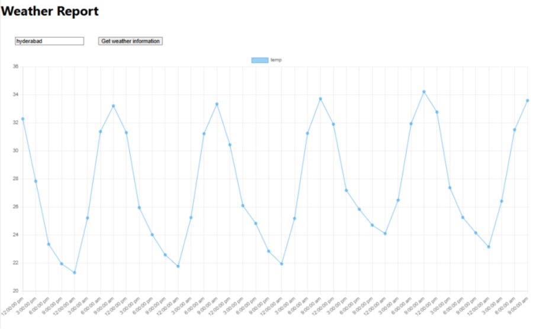

---

```markdown
# Experiment12 – 🎓 Student Management System (React App with Routing)


A single-page **React Application** that allows users to register, log in, and navigate between different sections of the student management system including **About**, **Contact**, and **Weather Information** pages. The app demonstrates the use of **React Router**, **component-based structure**, and **API data visualization using Chart.js**.

---

## 📑 Table of Contents

- [📌 Aim](#-aim)
- [📋 Description](#-description)
- [🚀 Features](#-features)
- [🧰 Technologies Used](#-technologies-used)
- [📁 Project Structure](#-project-structure)
- [⚙️ Installation & Setup](#️-installation--setup)
- [🌐 Pages Implemented](#-pages-implemented)
- [🧪 Screenshots](#-screenshots)
- [📝 License](#-license)

---

## 📌 Aim

To create a React-based **Student Management System** with client-side routing for pages like **Registration**, **Login**, **About**, **Contact**, and a real-time **Weather Information** chart using **Chart.js** and OpenWeatherMap API.

---

## 📋 Description

This React application demonstrates:
- How to build a modular SPA (Single Page Application)
- Implement routing between different views using React Router
- API integration with OpenWeatherMap
- Chart visualization with Chart.js
- Responsive and styled components using modern CSS

---

## 🚀 Features

- 📄 **Registration and Login Pages** (static UI for demo)
- 📍 **About and Contact Pages**
- 🌦️ **Weather Information Page** with Chart.js
- 🧭 **React Router Navigation**
- ⚙️ Modular folder structure
- 💅 Custom CSS styling

---

## 🧰 Technologies Used

- **Frontend Framework**: React.js (via Create React App)
- **Routing**: React Router DOM
- **Chart Visualization**: Chart.js, react-chartjs-2
- **API**: OpenWeatherMap
- **Styling**: Custom CSS (Canvas-style layout)

---

## 📁 Project Structure

Experiment12/
├── .gitignore                  # Ignore file for Git version control
├── package.json                # Project metadata and scripts
├── package-lock.json           # Lock file for consistent installs
├── README.md                   # Main documentation file

├── public/                     # Public assets
│   ├── favicon.ico
│   ├── image.png               # Custom image asset
│   ├── index.html              # HTML template
│   ├── logo192.png
│   ├── logo512.png
│   ├── manifest.json           # Progressive Web App configuration
│   └── robots.txt              # Bot crawling rules

├── src/                        # React application source code
│   ├── App.js                  # Main application component
│   ├── App.css                 # Styles for App.js
│   ├── App.test.js             # Test setup for App component
│   ├── index.js                # Entry point for React
│   ├── index.css               # Global styles
│   ├── logo.svg                # Default React logo
│   ├── reportWebVitals.js      # Performance reporting
│   ├── setupTests.js           # Jest

---

## ⚙️ Installation & Setup

### 🔧 Prerequisites

- Node.js & npm installed
- Basic knowledge of React
- Code editor like VS Code

### 📦 Steps to Run

1. **Create React App**
   ```bash
   npx create-react-app weather-app
   cd weather-app
````

2. **Install Required Libraries**

   ```bash
   npm install react-router-dom chart.js react-chartjs-2
   ```

3. **Create Folder Structure**

   ```bash
   mkdir src/components src/services
   ```

4. **Set Up Weather API**

   * In `src/services/weatherService.js`, implement OpenWeatherMap API logic.

5. **Create Chart Component**

   * In `src/components/WeatherChart.js`, use `Line` chart from Chart.js to show historical temperature.

6. **Build UI and Routing**

   * Use `App.js` to set up navigation between Registration, Login, About, Contact, and Weather components using `<Routes>` and `<Route>`.

7. **Run the App**

   ```bash
   npm start
   ```

8. **Open in Browser**

   ```
   http://localhost:3000
   ```

---

## 🌐 Pages Implemented

| Page        | Path        | Description                               |
| ----------- | ----------- | ----------------------------------------- |
| 🏠 Home     | `/`         | Landing/Home screen                       |
| 📝 Register | `/register` | Student Registration Form (static UI)     |
| 🔐 Login    | `/login`    | User Login Form (static UI)               |
| ℹ️ About    | `/about`    | Information about the application         |
| 📞 Contact  | `/contact`  | Contact details (static UI)               |
| 🌤️ Weather | `/weather`  | Real-time chart of 5-day temperature data |

---

## 🧪 Screenshots



---
