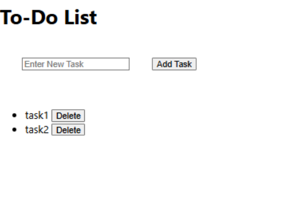

---

```markdown
# Experiment13 – ✅ React TODO Application


A simple and interactive **TODO List Application** built using React. This application allows users to add, complete, and delete daily tasks, demonstrating core concepts of React such as component-based architecture, state management, props, and styling.

---

## 🎯 Aim

To develop a TODO list frontend application using **React**, providing users the ability to manage tasks dynamically with a clean, modern Canva-style user interface. The project is also deployed to GitHub for public access and version control.

---

## 📖 Description

This experiment demonstrates how to create a **single-page TODO application** using **React.js**. The app enables users to:

- ➕ Add new tasks
- ✅ Mark tasks as completed
- ❌ Delete completed or unwanted tasks

It covers essential concepts such as:
- React functional components
- State management using `useState`
- Form handling
- Passing props between components
- Conditional rendering
- Custom styling using CSS

---

## 🧱 Project Structure

Experiment13/
├── .gitignore                  # Files and folders ignored by Git
├── package.json                # Project metadata, dependencies, scripts
├── package-lock.json           # Dependency lockfile for reproducibility
├── README.md                   # Project documentation

├── public/                     # Static files and public assets
│   ├── favicon.ico
│   ├── image.png               # Optional banner or logo
│   ├── index.html              # HTML entry point for React
│   ├── logo192.png
│   ├── logo512.png
│   ├── manifest.json           # Web app manifest for PWA support
│   └── robots.txt              # Web crawler rules

├── src/                        # Application source code
│   ├── App.js                  # Root component
│   ├── App.css                 # App-specific styles
│   ├── App.test.js             # App test file (Jest or Testing Library)
│   ├── index.js                # React entry point (DOM render)
│   ├── index.css               # Global styles
│   ├── logo.svg                # React logo
│   ├── reportWebVitals.js      # Performance measurement
│   ├── setupTests.js           # Test environment setup
│   ├── styles.css              # Custom global/component styling

│   ├── components/             # Reusable functional components
│   │   ├── TodoForm.js         # Input form for creating tasks
│   │   ├── TodoItem.js         # Individual to-do task item
│   │   └── TodoList.js         # Component that lists all to-dos

│   └── TodoItem.js             # (🔁 Duplicate — consider removing or refactoring)


---

## ⚙️ Installation & Setup

### 🔧 Prerequisites

- [Node.js](https://nodejs.org/) and npm installed
- Code editor like VS Code
- Basic understanding of React

### 📦 Steps to Run the Project

1. **Create the React App**
   ```bash
   npx create-react-app todo-app
   cd todo-app
````

2. **Create Components**
   Inside `src/components/`, create:

   * `TodoForm.js`
   * `TodoItem.js`
   * `TodoList.js`

3. **Implement Logic in App.js**

   * Use `useState()` to manage the task list.
   * Implement functions for adding, toggling completion, and deleting tasks.
   * Pass these functions as props to child components.

4. **Style the Application**

   * Customize layout and colors using `App.css` and `styles.css`.
   * Ensure a minimal and visually appealing Canva-style UI.

5. **Run the Application**

   ```bash
   npm start
   ```

6. **View in Browser**

   ```
   http://localhost:3000
   ```

---

## 🌐 Deployment to GitHub

To deploy this project to GitHub:

1. Create a GitHub repository (e.g., `todo-app-react`).
2. Initialize Git and push the code:

   ```bash
   git init
   git remote add origin https://github.com/your-username/todo-app-react.git
   git branch -M main
   git add .
   git commit -m "Initial commit"
   git push -u origin main
   ```
3. Enable GitHub Pages (if needed) via `gh-pages` or similar deployment.

---

## 🖼️ Screenshot



---

## 👨‍💻 Author

This project was created as part of **React Experiments** coursework to demonstrate essential frontend development skills using React.js.

---
